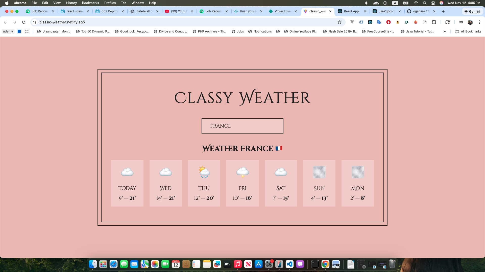

# Classy Weather App

A weather application built with **React Class Components**.  
This project is a great practice for understanding **React lifecycle methods**, **stateful class components**, and **working with external weather APIs**.

🔗 **Live Demo:** [Classic Weather App](https://classic-weather.netlify.app/)  
📂 **GitHub Repository:** [classy-weather-app](https://github.com/oganaa2472/classy-weather-app)

---

## Features

- Fetches real-time weather data from an external API
- Displays current temperature, weather conditions, and location
- Implements React class components and lifecycle methods
- Error handling for invalid locations or API failures

---

## Technologies Used

- React (Class Components)
- JavaScript (ES6+)
- CSS for styling
- External Weather API (e.g., OpenWeatherMap)

---


## Installation

1. Clone the repository:
```bash
git clone https://github.com/oganaa2472/classy-weather-app.git
